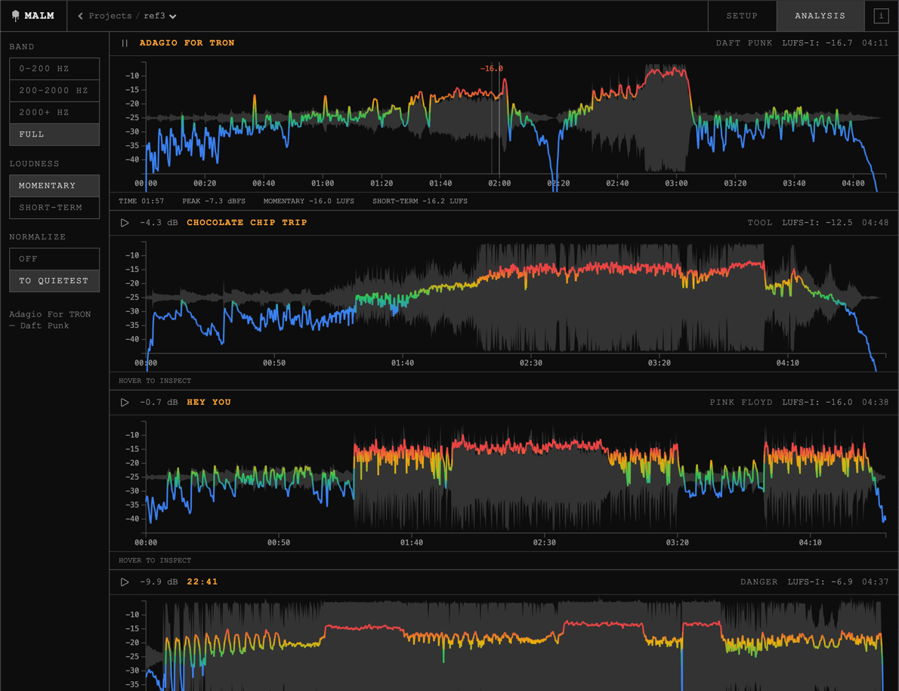

# malm — Multi Audio Loudness Measurement

**[→ Live app](https://malm.app)**



Compare EBU R128 loudness across frequency bands for multiple audio files. Drop in your tracks, set crossover frequencies, run analysis — all in the browser, no uploads.

## Develop

```sh
npm install
npm run dev
```

## Build

```sh
npm run build
```

## License

MIT — see [LICENSE](LICENSE)
